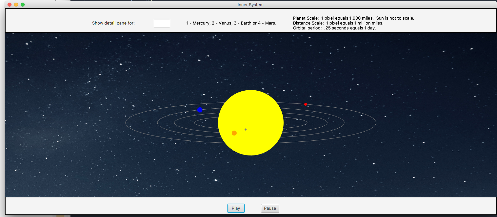

# Final Project Object Oriented Programming

## Synopsis
This program is a simulation of our inner solar system.  It is scaled within a 1500 pixel wide stage.  It contains play and pause buttons as well as a plaent detail text field option.

## Motivation
Primarily for my final project in Object Oriented Programming (Java).  This program uses a G.U.I and javaFX.

## How to Run
InnerSolarSystem java is the main program.  Simply run the Java.  DescriptionPane is for the planetary detail.

## Code Example
```
  /**
  * This method controls the pause / play action of the planet's orbit.
  * 
  * @param flag (boolean; whether to start or continue to play the animation.)
  */

  public void animationControl(boolean flag) {
    
    //  If animation play.
    if (flag == true) {
      mercuryPath.play();
      venusPath.play();
      earthPath.play();
      marsPath.play();
      flag = false;
    }
    else {
      mercuryPath.pause();
      venusPath.pause();
      earthPath.pause();
      marsPath.pause();
      flag = true;
    }
  }

```
## Tests
Does not have value returning methods.
